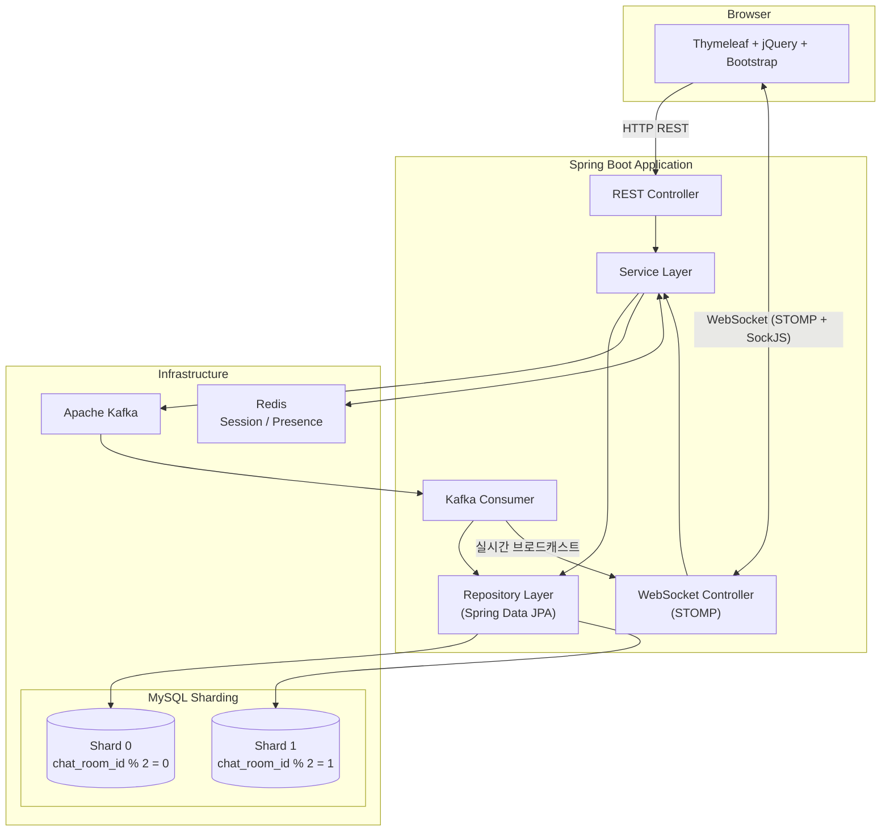
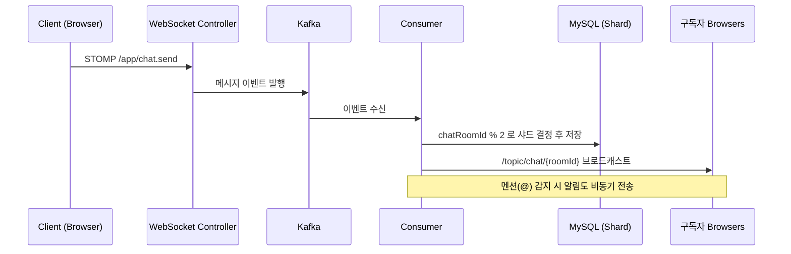

# Collaborative Messenger

> 팀 커뮤니케이션을 위해 설계된 실시간 메신저 플랫폼  
> 채팅, 파일 전송, 온라인 상태, 알림, 업무 리포트를 하나로 통합한 협업 시스템


## 1. 프로젝트 한눈에 보기

`Collaborative Messenger`는 단순 채팅 앱이 아니라,  
실시간 메시징과 협업 데이터를 함께 다루는 **업무형 메신저 백엔드/웹 서비스**입니다.

- WebSocket 기반 실시간 채팅
- 파일/이미지 첨부 메시지
- 친구 온라인/오프라인 상태 확인
- 알림 및 읽음 상태 관리
- 일일 업무 리포트 자동 생성/관리
- Kafka + 샤딩 구조를 활용한 확장형 메시지 처리

## 2. 핵심 기능

### 실시간 채팅
- 채팅방 메시지 실시간 송수신 (STOMP over WebSocket)
- 연결 불안정 시 Polling fallback 동작
- 1:1 / 그룹 채팅방 지원

### 파일/이미지 전송
- 채팅방 파일 업로드 및 다운로드 링크 제공
- 이미지 메시지 썸네일/미리보기 렌더링
- 전송 전 확인 UX 지원(파일명/미리보기/최종 확인)

### 친구/사용자 상태
- 친구 목록 관리
- 온라인/오프라인 상태 확인
- 세션 기반 사용자 인증 상태 유지

### 알림/읽음 처리
- 메시지 도착/읽음 상태 관리
- 사용자별 알림 조회
- 미확인 메시지 카운트 처리

### 업무 리포트
- 일일 리포트 생성 및 조회/수정
- 스케줄링 기반 자동 생성
- 협업 기록 기반 리포트 흐름 확장 가능

## 3. 기술 스택

| 분류 | 기술 |
|---|---|
| **Language** | Java 17 |
| **Framework** | Spring Boot 4, Spring MVC, Spring Security, Spring Data JPA |
| **Real-time** | WebSocket, STOMP, SockJS |
| **Frontend** | Thymeleaf (SSR), jQuery, Bootstrap 5 |
| **Database** | MySQL 8 (Shard 0 / Shard 1) |
| **Cache & Session** | Redis (Spring Session) |
| **Messaging** | Apache Kafka + Zookeeper |
| **Infra** | Docker Compose, GitHub Actions CI/CD |
| **Test** | JUnit 5, Mockito, AssertJ |

## 4. 시스템 아키텍처

### 전체 구성도



### 채팅 메시지 흐름



### 핵심 흐름 요약

| 단계 | 설명 |
|:---:|---|
| **1** | 클라이언트가 REST 또는 WebSocket(STOMP)으로 메시지 전송 |
| **2** | 서버가 Kafka 토픽 `chat.message.sent`에 이벤트 발행 |
| **3** | Consumer가 샤딩 규칙(`chatRoomId % 2`)에 따라 MySQL에 저장 |
| **4** | 해당 채팅방 구독자 전원에게 실시간 브로드캐스트 |
| **5** | Redis가 세션 관리 및 사용자 접속 상태를 처리 |

## 5. 빠른 실행 방법 (로컬)

### 필수 준비
- Docker / Docker Compose
- JDK 17

### 실행
```bash
# 1) 인프라 실행 (MySQL, Redis, Kafka, Zookeeper)
docker compose up -d

# 2) 애플리케이션 실행
./gradlew bootRun
```

### 접속
- 애플리케이션: `http://localhost:8888`

## 6. 프로젝트 구조

```text
src/main/java/com/messenger/
├── chat/                       # 채팅 도메인
│   ├── controller/             #   REST + WebSocket 컨트롤러
│   ├── service/                #   비즈니스 로직
│   ├── repository/             #   데이터 접근 (JPA)
│   ├── entity/                 #   엔티티 (ChatRoom, ChatMessage, ...)
│   ├── dto/                    #   요청/응답 DTO
│   └── event/                  #   Kafka 이벤트 객체
│
├── user/                       # 사용자 도메인
│   ├── controller/             #   Auth, User, Friendship, Team, Admin
│   ├── service/                #   인증, 회원, 친구, 팀, 이메일 인증
│   ├── repository/             #   JPA Repository
│   ├── entity/                 #   User, Friendship, Team, ...
│   ├── dto/                    #   요청/응답 DTO
│   └── config/                 #   초기화 (Admin, Prune)
│
├── notification/               # 알림 도메인
│   ├── controller/             #   알림 REST API
│   ├── service/                #   알림 생성 + WebSocket 전송
│   ├── repository/             #   JPA Repository
│   ├── entity/                 #   Notification, NotificationType
│   └── dto/                    #   NotificationResponse
│
├── report/                     # 업무 리포트 도메인
│   ├── controller/             #   리포트 API
│   ├── service/                #   리포트 생성/분석
│   ├── entity/                 #   DailyReport, ReportItem
│   └── dto/                    #   리포트 DTO
│
├── worklog/                    # 워크로그 (GitHub 커밋 기반)
│   ├── controller/             #   워크로그 API
│   ├── service/                #   GitHub API 연동 + 요약 생성
│   └── dto/                    #   워크로그 DTO
│
├── infrastructure/             # 인프라 설정
│   ├── config/                 #   WebSocket, Security, Async, Redis
│   ├── kafka/                  #   Kafka Consumer
│   ├── sharding/               #   DB 샤딩 (라우팅, AOP)
│   └── mail/                   #   메일 발송
│
└── common/                     # 공통 모듈
    ├── dto/                    #   ApiResponse (통일된 응답 형식)
    ├── exception/              #   ErrorCode, BusinessException, Handler
    ├── entity/                 #   BaseEntity (createdAt, updatedAt)
    └── logging/                #   AOP 로깅
```

## 7. 테스트

```bash
# 전체 단위 테스트 실행
./gradlew test
```

| 테스트 클래스 | 대상 | 주요 검증 항목 |
|---|---|---|
| `UserServiceTest` | 사용자 서비스 | 회원가입, 조회, 프로필 수정, 비밀번호 변경 |
| `AuthServiceTest` | 인증 서비스 | 로그인 성공/실패, 로그아웃, 비활성 계정 |
| `FriendshipServiceTest` | 친구 관계 서비스 | 친구 요청/수락/거절, 권한 검증 |
| `ChatRoomServiceTest` | 채팅방 서비스 | 채팅방 생성/조회/나가기, 멤버 관리 |
| `NotificationServiceTest` | 알림 서비스 | 알림 생성, 읽음 처리, 소유권 검증 |
| `MessageAnalyzerTest` | 메시지 분석기 | 키워드 기반 업무 카테고리 분류 |
| `ShardKeyHolderTest` | 샤드 키 관리 | ThreadLocal 기반 샤드 키 설정/해제 |

## 8. CI/CD 자동화

이 저장소에는 GitHub Actions 워크플로우가 포함되어 있습니다.

- `ci.yml`
  - Push / PR 시 빌드 + 테스트 자동 수행
- `deploy-vps.yml`
  - `main` 브랜치 push 시 VPS 자동 배포

### 배포 시크릿(Repository Secrets)
- `VPS_HOST`
- `VPS_USER`
- `VPS_SSH_KEY`

## 9. 운영 시 권장사항

- 기본 비밀번호/접속정보 즉시 변경
- HTTPS 리버스 프록시(Nginx + Certbot) 적용
- 업로드 파일을 로컬 디스크 대신 Object Storage(S3 호환)로 이전
- 모니터링(Prometheus/Grafana) 및 로그 수집(ELK/Loki) 추가

## 10. 로드맵

- OAuth2 소셜 로그인
- S3 기반 파일 스토리지 분리
- 멀티 노드 WebSocket 스케일링
- Blue/Green 또는 Rolling 배포
- 장애 대응 자동화(헬스체크 + 롤백)

## 11. 라이선스

MIT
